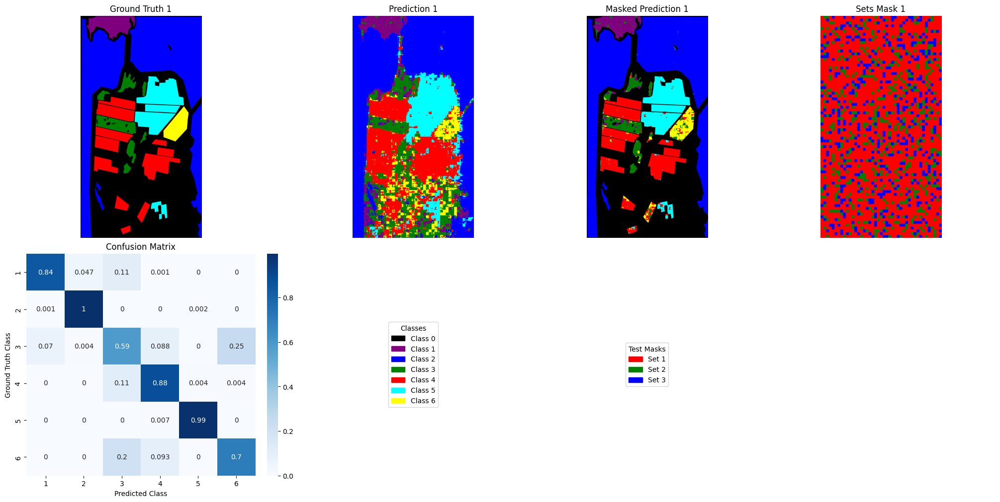

# Semantic segmentation of PolSF with a complex valued UNet

This complete example provides a strong codebase for training a complex valued
UNet for the semantic segmentation of PolSF.

The codebase is parametrized by a yaml file in which you can customize your
experiment.

## Setup

To use it :

```bash
python3 -m venv venv
source venv/bin/activate

python -m pip install -e .
<OR>
python -m pip install .
```

## Getting the data

You need to download manually the data. To download the PolSF dataset, please follow the following link: [https://ietr-lab.univ-rennes1.fr/polsarpro-bio/san-francisco/dataset/SAN_FRANCISCO_ALOS2.zip](https://ietr-lab.univ-rennes1.fr/polsarpro-bio/san-francisco/dataset/SAN_FRANCISCO_ALOS2.zip). **Important**: you must move the file SF-ALOS2-label2d.png from the sub-folder Config_labels to the main folder.

## Training

For training, you need to provide a YAML configuration file. As an example, you
can check the `configs/config.yml`. At least you need to adapt the path to the
data with the `data/dataset/trainpath` key.


And then you can run the code by providing your `config.yaml` :

```
python -m torchtmpl.main train configs/config.yml
```

With the config we provide, a low end GPU will be sufficient. It requires $3 GB$
of VRAM.

The best model will be saved into a directory specific to the run into the `logs` subdirectory.

An example output is :

```bash
02/21/2025 05:02:32 PM Loading config2.yaml
02/21/2025 05:02:32 PM = Building the dataloaders
02/21/2025 05:02:32 PM   - Dataset creation
02/21/2025 05:03:05 PM   - Training set: 2377 samples
02/21/2025 05:03:05 PM   - Validation set: 510 samples
02/21/2025 05:03:05 PM   - Test set: 510 samples
02/21/2025 05:03:28 PM = Model
02/21/2025 05:03:28 PM = Loss
02/21/2025 05:03:28 PM = Optimizer
02/21/2025 05:03:28 PM Will be logging into logs/UNet_4
02/21/2025 05:04:32 PM [1/301] Valid loss: 0.852 LR: 0.005000 [>> BETTER <<]
02/21/2025 05:05:36 PM [2/301] Valid loss: 0.831 LR: 0.005000 [>> BETTER <<]
02/21/2025 05:06:40 PM [3/301] Valid loss: 0.809 LR: 0.005000 [>> BETTER <<]
02/21/2025 05:07:44 PM [4/301] Valid loss: 0.595 LR: 0.005000 [>> BETTER <<]
02/21/2025 05:08:48 PM [5/301] Valid loss: 0.463 LR: 0.004500 [>> BETTER <<]
02/21/2025 05:09:52 PM [6/301] Valid loss: 0.381 LR: 0.004500 [>> BETTER <<]
02/21/2025 05:10:56 PM [7/301] Valid loss: 0.328 LR: 0.004500 [>> BETTER <<]
02/21/2025 05:12:01 PM [8/301] Valid loss: 0.146 LR: 0.004500 [>> BETTER <<]
02/21/2025 05:13:05 PM [9/301] Valid loss: 0.118 LR: 0.004500 [>> BETTER <<]
02/21/2025 05:14:09 PM [10/301] Valid loss: 0.116 LR: 0.004050 [>> BETTER <<]
02/21/2025 05:15:13 PM [11/301] Valid loss: 0.279 LR: 0.004050 
02/21/2025 05:16:16 PM [12/301] Valid loss: 0.121 LR: 0.004050 
02/21/2025 05:17:20 PM [13/301] Valid loss: 0.102 LR: 0.004050 [>> BETTER <<]
02/21/2025 05:18:24 PM [14/301] Valid loss: 0.132 LR: 0.004050 
02/21/2025 05:19:28 PM [15/301] Valid loss: 0.124 LR: 0.003645 
02/21/2025 05:20:31 PM [16/301] Valid loss: 0.107 LR: 0.003645 
02/21/2025 05:21:35 PM [17/301] Valid loss: 0.126 LR: 0.003645 
02/21/2025 05:22:39 PM [18/301] Valid loss: 0.106 LR: 0.003645 
02/21/2025 05:23:42 PM [19/301] Valid loss: 0.097 LR: 0.003645 [>> BETTER <<]
02/21/2025 05:24:46 PM [20/301] Valid loss: 0.105 LR: 0.003281 
02/21/2025 05:25:50 PM [21/301] Valid loss: 0.102 LR: 0.003281 
02/21/2025 05:26:54 PM [22/301] Valid loss: 0.103 LR: 0.003281 
02/21/2025 05:27:57 PM [23/301] Valid loss: 0.11 LR: 0.003281 
02/21/2025 05:29:01 PM [24/301] Valid loss: 0.104 LR: 0.003281 
02/21/2025 05:30:05 PM [25/301] Valid loss: 0.094 LR: 0.002952 [>> BETTER <<]
02/21/2025 05:31:08 PM [26/301] Valid loss: 0.109 LR: 0.002952 
02/21/2025 05:32:12 PM [27/301] Valid loss: 0.102 LR: 0.002952 
02/21/2025 05:33:16 PM [28/301] Valid loss: 0.113 LR: 0.002952 
02/21/2025 05:34:19 PM [29/301] Valid loss: 0.096 LR: 0.002952 
02/21/2025 05:35:23 PM [30/301] Valid loss: 0.115 LR: 0.002657 
02/21/2025 05:36:26 PM [31/301] Valid loss: 0.112 LR: 0.002657 
02/21/2025 05:37:30 PM [32/301] Valid loss: 0.093 LR: 0.002657 [>> BETTER <<]
02/21/2025 05:38:34 PM [33/301] Valid loss: 0.09 LR: 0.002657 [>> BETTER <<]
02/21/2025 05:39:38 PM [34/301] Valid loss: 0.094 LR: 0.002657 
02/21/2025 05:40:42 PM [35/301] Valid loss: 0.099 LR: 0.002391 
02/21/2025 05:41:46 PM [36/301] Valid loss: 0.086 LR: 0.002391 [>> BETTER <<]
02/21/2025 05:42:50 PM [37/301] Valid loss: 0.099 LR: 0.002391 
02/21/2025 05:43:53 PM [38/301] Valid loss: 0.106 LR: 0.002391 
02/21/2025 05:44:57 PM [39/301] Valid loss: 0.09 LR: 0.002391 
02/21/2025 05:46:01 PM [40/301] Valid loss: 0.11 LR: 0.002152 
02/21/2025 05:47:04 PM [41/301] Valid loss: 0.146 LR: 0.002152 
02/21/2025 05:48:08 PM [42/301] Valid loss: 0.105 LR: 0.002152 
02/21/2025 05:49:12 PM [43/301] Valid loss: 0.097 LR: 0.002152 
02/21/2025 05:50:15 PM [44/301] Valid loss: 0.111 LR: 0.002152 
02/21/2025 05:51:19 PM [45/301] Valid loss: 0.111 LR: 0.001937 
02/21/2025 05:52:22 PM [46/301] Valid loss: 0.124 LR: 0.001937 
02/21/2025 05:53:26 PM [47/301] Valid loss: 0.11 LR: 0.001937 
02/21/2025 05:54:30 PM [48/301] Valid loss: 0.119 LR: 0.001937 
02/21/2025 05:55:33 PM [49/301] Valid loss: 0.093 LR: 0.001937 
02/21/2025 05:56:37 PM [50/301] Valid loss: 0.101 LR: 0.001743 
02/21/2025 05:57:40 PM [51/301] Valid loss: 0.121 LR: 0.001743 
02/21/2025 05:58:44 PM [52/301] Valid loss: 0.102 LR: 0.001743 
02/21/2025 05:59:47 PM [53/301] Valid loss: 0.091 LR: 0.001743 
02/21/2025 06:00:51 PM [54/301] Valid loss: 0.104 LR: 0.001743 
02/21/2025 06:01:55 PM [55/301] Valid loss: 0.085 LR: 0.001569 [>> BETTER <<]
02/21/2025 06:02:59 PM [56/301] Valid loss: 0.085 LR: 0.001569 
02/21/2025 06:04:03 PM [57/301] Valid loss: 0.084 LR: 0.001569 [>> BETTER <<]
02/21/2025 06:05:07 PM [58/301] Valid loss: 0.097 LR: 0.001569 
02/21/2025 06:06:11 PM [59/301] Valid loss: 0.1 LR: 0.001569 
[...]


```

## Testing

For testing the model on the test fold, it is as simple as running the library
with the log directory of your run

```
python -m torchtmpl.main test logs/UNet_0
```

This will reload the right configuration, the seed used during training (to
guarantee we use the same folds), the best model and evaluate it. The outputs
are saved in the run logdir.

An example output generated by the test is give below :



